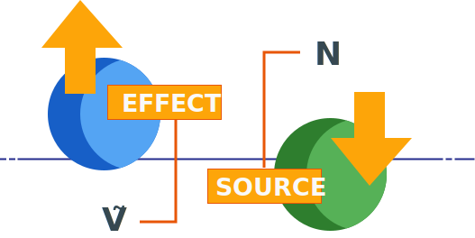
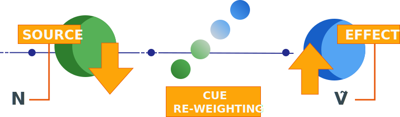
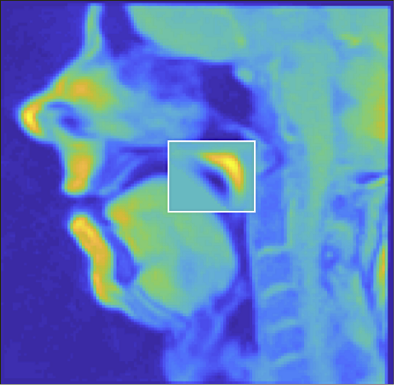
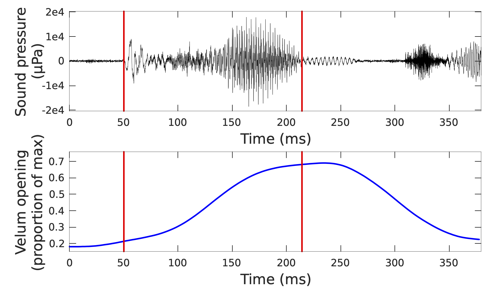
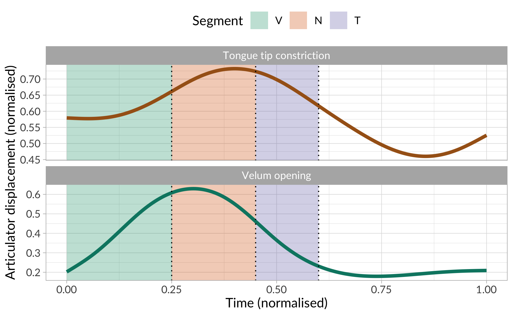
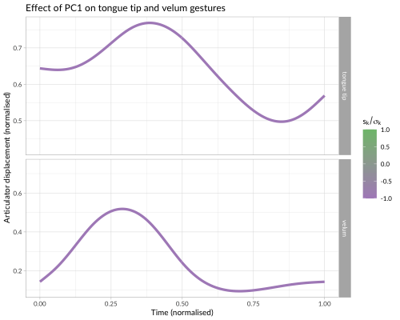
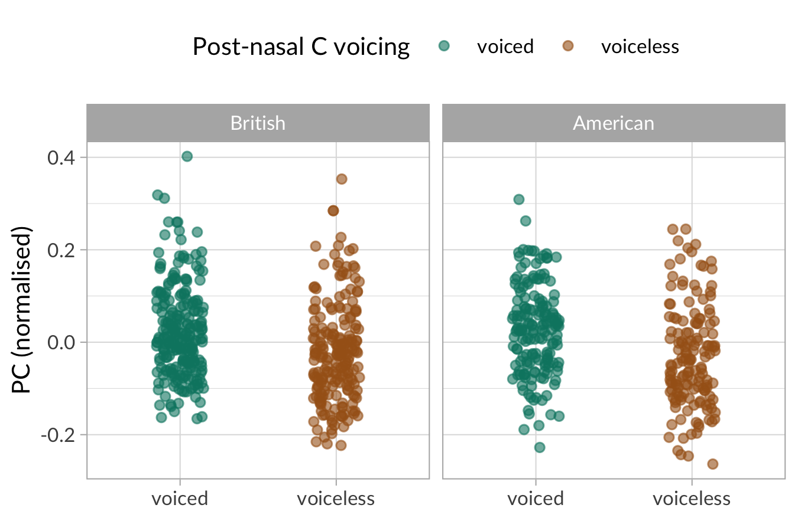

```{r setup, include=FALSE}
knitr::opts_chunk$set(echo = FALSE, message = FALSE)
knitr::opts_knit$set(root.dir = here::here())
options(htmltools.dir.version = FALSE)
library(tidyverse)
theme_set(theme_minimal())
library(ggmosaic)
library(leaflet)
library(sf)
library(ritwals)
options(
  ggplot2.discrete.fill = c("#a6611a", "#018571", "#264653", "#2a9d8f", "#a8dadc", "#457b9d", "#e76f51")
)
```

```{r xaringanExtra, echo=FALSE}
xaringanExtra::use_xaringan_extra(c("panelset", "tachyons"))
```

---

class: middle

# Overview

.f2[
- Conceptual background

- Typological survey

- Contrastive nasalisation

- English MRI data

]

---

class: inverse middle center bg-black

# .small-caps[conceptual background]

---

# Phon(et)ological systems

---

# Phonologisation

.panelset[
.panel[.panel-name[Structuralism]
.bg-washed-green.b--dark-green.ba.bw2.br3.shadow-5.ph4.mt5[

Phonologisation is the creation of a new phonemic contrast, or in other words when a contextual allophone becomes *contrastive* (i.e. a phoneme).

]

.tr[
— Kiparsky 2015
]

]

.panel[.panel-name[Lexical Ph]
.bg-washed-blue.b--dark-blue.ba.bw2.br3.shadow-5.ph4.mt5[

A process is phonologised when it goes from being post-lexical to being lexical.

]

.tr[
— Kiparsky 1988
]

]

.panel[.panel-name[Stratal OT]


.bg-washed-yellow.b--gold.ba.bw2.br3.shadow-5.ph4.mt5[

Phonologisation occurs when the constraint ordering of the phrasal domain is carried over to the word and stem domains.

]

.tr[
— Kiparsky 2000, Bermúdez-Otero 2017
]

]

.panel[.panel-name[Life Cycle]

.bg-near-white.b--purple.ba.bw2.br3.shadow-5.ph4.mt5[

Phonologisation occurs when a physio-anatomical ("mechanic") phenomenon comes under the control of the speaker/hearer and becomes part of their grammar (more specifically, part of the *phonetic module* of the grammar).

]

.tr[
— Bermúdez-Otero 2007, Bermúdez-Otero 2015
]

]

.panel[.panel-name[Exemplar]

.bg-washed-yellow.b--orange.ba.bw2.br3.shadow-5.ph4.mt5[

Every type of sound variation/alternation is "phonologised" (i.e. neuro-cognitive permanence) as soon as it is experienced by the speaker/hearer *and* stored in memory.

]

.tr[
— Johnson 1997, Sóskuthy et al. 2018, Ambridge 2018, Todd et al. 2019
]

]

]

---

class: inverse, center, middle bg-black

# .dark-green[.small-caps[vowel nasalisation]]

---

class: inverse, center, middle bg-black

# .small-caps[coarticulatory]

# ⬆︎

# .dark-green[.small-caps[vowel nasalisation]]

# ⬇︎

# .small-caps[contrastive]


---
class: inverse middle center bg-black

# .small-caps[contrastive nasalisation]

---
class: middle

.center[
.b[Konai]
.pull-left[
[d̪iɔ] 'bone'
]
.pull-right[
[d̪ĩɔ̃] 'grass'
]

.b[Lakota]
.pull-left[
[ˈsu] 'seed'
]
.pull-right[
[ˈsũ] 'braid'
]

.b[Palantla Chinantec]
.pull-left[
[háa] 'so'
]
.pull-right[
[háã] 'foam'
]

]

---

class: middle

# Distribution

```{r vnas-map}
vow_nas <- get_feature("10A") %>%
  st_as_sf(coords = c("longitude", "latitude")) %>%
  arrange(value)

pal <- colorFactor(c("#a6611a", "#018571"), domain = c("Contrast absent", "Contrast present"))

leaflet(vow_nas, width = "100%", height = "400") %>%
  addTiles() %>%
  addCircleMarkers(
    stroke = FALSE,
    color = ~pal(value), fillOpacity = ~ifelse(value == "Contrast present", 0.9, 0.4), radius = 5
  ) %>%
  addLegend(pal = pal, values = ~value, title = "Vowel nasalisation")
```

.right[Vowel nasalisation in WALS]

---

class: center middle

```{r vnas-mos, fig.height=3, fig.width=4, dpi=320}
p <- vow_nas %>%
  ggplot() +
  geom_mosaic(aes(product(value), fill = value), alpha = 1) +
  labs(x = "") +
  theme(legend.position = "none")

p + geom_text(
  data = ggplot_build(p)$data[[1]],
  aes(
    x = (xmin + xmax)/2,
    y = (ymin + ymax)/2,
    label = paste0(round((xmax - xmin) * 100), "%")
  ),
  colour = "white",
  fontface = "bold"
  )
```

---

class: center middle

```{r vnas-mos-area, fig.height=3, fig.width=4, dpi=320}
p_2 <- vow_nas %>%
  ggplot() +
  geom_mosaic(aes(product(macroarea), fill = value), alpha = 1, divider = mosaic("v")) +
  labs(x = "", y = "") +
  theme(legend.position = "none")

p_data <- ggplot_build(p_2)$data[[1]] %>%
  mutate(
    xc = (xmin + xmax)/2,
    yc = (ymin + ymax)/2,
    perc = round((xmax - xmin) * (ymax - ymin) * 100),
    label = ifelse(perc > 0, paste0(perc, "%"), "")
  )

p_2 + geom_text(
  data = p_data,
  aes(
    x = xc,
    y = yc,
    label = label
  ),
  size = 8 / .pt,
  colour = "white",
  fontface = "bold"
  )
```


---

class: inverse middle center bg-black

# .dark-green[What does it take?]

---

class: inverse middle center bg-black

# .dark-green[VOWEL~NASAL <br><br> COARTICULATION]

---

class: middle

# Case study: Rio-Branco (Arawakan)

```{r glosso-loc}
glosso <- tibble(
  glossonym = c("Mawayana", "Wapishana"),
  latitude = c(2.356160446326157, 2.59),
  longitude = c(-56.79468168986823, -59.80)
) %>%
  st_as_sf(coords = c("longitude", "latitude"))

leaflet(glosso, width = "100%", height = "400") %>%
  addTiles() %>%
  addPopups(popup = ~glossonym, options = popupOptions(closeButton = FALSE)) %>%
  setView(-58, 5, zoom = 4)
```

---

class: center middle

.pull-left[
**Mawayana**

/n-ɗeː/

1sg-child

]

--

.pull-right[
**Wapishana**

/ũ-ɖa(-ni)/

1sg-kin(-?)
]

--

→ Proto-Rio-Branco \**nu* '1sg'

--

.pull-left[
/n-nũː/

1sg-1sg.SUBJ
]

.pull-right[
/ũ(-gaɽɨ)/

1sg.SUBJ
]

---

class: middle center

# Ṽ.green[N] > Ṽ.light-green[N] > Ṽ.light-gray[N] >  .green[Ṽ]

---

class: inverse middle right bg-black

# What does the development of .dark-green[contrastive nasalisation] look like?


---

# Source/Effect Trading model (SET)


.panelset[

.panel[.panel-name[Concept]

.center[

]

.tr[
— Beddor 2009, 2012
]

]

.panel[.panel-name[Expectations]

.bg-washed-green.b--dark-green.ba.bw2.br3.shadow-5.ph4.mt5[

1. Diachronically, the **velum gesture shifts earlier** (towards the vowel) but its duration and amplitude don't change.

2. Synchronically, this should show up as an **earlier velum gesture if the C in NC is voiceless** (e.g. *bent* vs *bend*).

]

.tr[
— Beddor 2009, 2012
]

]

.panel[.panel-name[Observed]

.bg-washed-yellow.b--orange.ba.bw2.br3.shadow-5.ph4.mt5[

Synchronic data from ~30 German speakers.

➜ The velum gesture is earlier when C is voiceless, ***but* both duration and amplitude decrease**.

]

.tr[
— Carignan et al. 2021
]

]

]

---

# Cue Re-Weighting model (CReW)



.tr[
— Carignan et al. 2021
]

---

class: inverse, center, middle bg-black

# What does the<br>.dark-green[reduction of nasals]<br>look like?

---

class: inverse center middle bg-black

# .dark-green[nasal]<br>=<br>oral constriction<br>+<br>velum opening

---

class: inverse center middle bg-black

# .dark-green[nasal]<br>=<br>tongue tip constriction<br>+<br>velum opening

---

# British and American English

.bg-washed-yellow.b--orange.ba.bw2.br3.shadow-5.ph4.mt5[
.f2[41 speakers (24 BrE, 17 AE)]
]
.bg-washed-green.b--dark-green.ba.bw2.br3.shadow-5.ph4.mt5[
.f2[*Saw **bent** about two*]

.f2[*Saw **bend** about two*]
]

---

# Real-time MRI

.cf.ph2-ns[

.fl.w-40.pa2[

]

.fl.w-60.pa2[

]

]

---

# Tongue tip and velum

.center[

]


---

# Tongue tip and velum

.center[

]

---

# Tongue tip and velum

.center[

]

---

# Open questions

.bg-washed-yellow.b--orange.ba.bw2.br3.shadow-5.ph4.mt2[
A **looser tongue-tip** constriction corresponds to **greater velum opening**.

➤ What does this mean for the development of contrastive vowel nasalisation?
]

--

.bg-washed-yellow.b--orange.ba.bw2.br3.shadow-5.ph4.mt2[
There are more languages that maintain a tongue-tip constriction than languages that don't.

➤ Which are the (pre)-conditions for the **complete loss** of the tongue-tip constriction?
]

--

.bg-washed-yellow.b--orange.ba.bw2.br3.shadow-5.ph4.mt2[
The degree of nasalisation in contrastive nasalised vowels tends to be greater than that of coarticulatory nasalisation.

➤ Does nasal reduction drive increased nasalisation, the other way around, or both?
]

---

class: inverse, middle, center, bg-black

# That's all!

(ask me about this meme)


---

